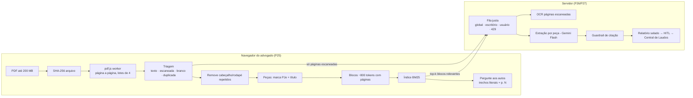

# Leitura de Autos — arquitetura e capacidade (P25 → P27)

Objetivo: advogados de um grande escritório (referência: **2.000 usuários simultâneos**) enviando autos de **500+ páginas** sem travar a interface nem o servidor, com toda resposta citando a página de origem.

## Princípios

1. **O trabalho pesado roda onde ele escala sozinho.** Parse do PDF, triagem, separação de peças e indexação rodam no navegador de cada advogado (pdf.js worker). 2.000 usuários = 2.000 CPUs; o servidor não recebe essa carga.
2. **O servidor só faz o que precisa ser central** (OCR, IA, persistência), sempre atrás de uma **fila justa** com limites por plataforma, escritório e usuário.
3. **Nada sem página.** Todo fato, trecho ou resposta carrega `p. N`. O Guardrail rejeita citação que não confere com o texto da página.
4. **Idempotência por hash.** Arquivo e páginas têm SHA-256; a mesma página nunca é processada duas vezes (dedupe em voo + cache).

## Fluxo

## O que já está pronto (P25)

| Componente | Arquivo | Validação |
|---|---|---|
| Triagem, limpeza, peças, blocos | `src/documents/autos/autosCore.ts` | 12 testes; **16/16 peças corretas** em autos fictícios de 496 páginas |
| Índice BM25 com citação | `src/documents/autos/indiceBm25.ts` | busca < 1 ms; "não encontrado" quando não há base |
| Leitor incremental de PDF | `src/documents/autos/leitorPdf.ts` | worker local (sem CDN), cede a vez à UI a cada lote |
| Painel | `src/components/autos/LeituraAutosPanel.tsx` | progresso, peças, busca, visualizador com salto de página |
| Fila justa (servidor) | `src/server/autos/filaJusta.ts` | 8 testes; carga de **2.000 usuários × 5 tarefas em 40 escritórios** com teto de 64 simultâneas respeitado |
| Gerador de autos fictícios | `scripts/gerar_autos_ficticios.py` | reprodutível (seed fixa) |

Medido no teste com 496 páginas (texto já extraído): triagem + peças + blocos + índice ≈ **140 ms**. A extração do pdf.js no navegador depende da máquina e precisa ser medida em campo.

## Capacidade para 2.000 advogados

Premissas (ajustar com dados reais do escritório):

- **Pico:** 10% dos usuários enviando autos na mesma hora → 200 autos/h. O cenário extremo (todos ao mesmo tempo) é tratado por backpressure, não por superdimensionamento.
- **Autos:** 500 páginas, ~15% escaneadas, ~40 peças.
- **IA por autos (P26):** ~40 chamadas de extração, uma por peça, com top-k blocos do BM25 em vez do texto inteiro, mais ~75 OCRs.

| Recurso | Cálculo | Ordem de grandeza |
|---|---|---|
| CPU de parse | no navegador | **0 no servidor** |
| Chamadas de IA/h | 200 × (40 + 75) | ~23 mil/h ≈ 6,4/s |
| Concorrência de IA | 6,4/s × ~3 s de latência | ~20 simultâneas (a fila permite 64) |
| Cenário extremo | 2.000 autos juntos | fila absorve e responde **429 + Retry-After**; ninguém trava, escritórios pequenos não esperam os grandes (round-robin) |

A cota do provedor de IA (RPM/TPM) é o gargalo real. Ela precisa ser contratada para o pico. A fila garante que, ao atingi-la, o sistema desacelera de forma justa em vez de falhar.

## Limites e garantias da fila (padrão)

| Parâmetro | Valor | Por quê |
|---|---|---|
| `concorrenciaGlobal` | 64 | protege a cota do provedor |
| `concorrenciaPorTenant` | 16 | um escritório não monopoliza |
| `concorrenciaPorUsuario` | 4 | um advogado não monopoliza o escritório |
| `maxPendentesPorTenant` | 5.000 | acima disso: 429 com Retry-After |
| Dedupe | chave = hash da página | a mesma página enviada por 2 pessoas vira 1 chamada |
| Retentativa | 4×, backoff exponencial com jitter | só para 429/5xx do provedor |

## Próximas fases

- **P26 — IA e OCR:** rota `/api/autos/ocr` e `/api/autos/extrair` atrás da `FilaJusta`, com chave Gemini no servidor e ZDR ligado. Inclui extração estruturada por peça (partes, pedidos, valores, datas, prazos), linha do tempo, Guardrail de citação e envio à fila HITL.
- **P27 — produção multi-instância:** a fila migra para Cloud Tasks/Pub/Sub e o estado para Redis, com a mesma interface. O PDF vai para o Cloud Storage via URL assinada (sem passar pelo servidor). Índice vetorial em pgvector/AlloyDB e texto por página persistido para reuso entre advogados do mesmo processo.
- **Teste de carga (P27):** k6 com 2.000 usuários virtuais e perfil de pico. SLO: p95 de enfileiramento < 200 ms e zero erro 5xx.

## LGPD

- Na P25, o arquivo não sai do navegador.
- Na P26, só páginas escaneadas e blocos selecionados vão ao provedor, com ZDR.
- Hash do arquivo e das páginas na trilha de auditoria.
- Isolamento por tenant em todas as chaves de fila e cache.

## P26 — servidor pronto (IA, OCR, Guardrail de citação, HITL)

| Componente | Arquivo | Validação |
|---|---|---|
| Guardrail de citação (puro, roda também no navegador) | `src/documents/autos/citacao.ts` | trecho literal da página; valor/data precisam estar DENTRO do trecho |
| Prompt, parser da resposta, extrator determinístico | `src/server/autos/extracaoPeca.ts` | autos delimitados como dado (anti prompt-injection) |
| Relatório + linha do tempo | `src/server/autos/relatorioAutos.ts` | só fatos CONFERE; hash de conteúdo estável |
| Serviço (sem Express) | `src/server/autos/servicoAutos.ts` | 21 testes em `leituraIa.nodetest.ts` (`npm run test:autos`) |
| Provedor Gemini | `src/server/autos/provedorGemini.ts` | chave só no servidor; fallback de modelo; nada de conteúdo em log |
| Rotas | `src/server/autos/routes.ts` | `/api/autos/status · ocr · extrair · relatorio` |

Regras:
- **Nada sem página:** fato cujo trecho não aparece literalmente na página citada é marcado e nunca entra no relatório.
- **O navegador não injeta fato:** `/relatorio` só consolida o que ESTE servidor extraiu para ESTE escritório (cache por tenant).
- **Backpressure:** fila cheia → 429 + Retry-After. Provedor fora → extrator determinístico, marcado como `origem: deterministico`.
- **LGPD/ZDR:** em produção sem demo, a IA de autos só liga com `AUTOS_ZDR_CONFIRMADO=true`. Ledger guarda só hashes.
- **HITL:** `enviarParaRevisao: true` cria WorkItem GERAR_LAUDO_FINAL (READY_FOR_REVIEW), idempotente pelo hash do conteúdo. Relatório sem nenhum fato conferido não vai para revisão.

Variáveis: `GEMINI_API_KEY`, `AUTOS_MODELOS` (padrão `gemini-3.8-flash,gemini-3.1-flash-lite`), `AUTOS_ZDR_CONFIRMADO`.

## P26b — painel ligado às rotas

| Componente | Arquivo |
|---|---|
| Seleção de páginas por peça (1ª + 2 últimas + top BM25, teto 30 pág./240 mil caracteres) | `src/documents/autos/selecaoPaginas.ts` (3 testes) |
| Página escaneada → JPEG ~150 dpi, ≤ 850 KB em base64 | `src/documents/autos/ocrImagem.ts` |
| Cliente das rotas (Bearer, 429 → espera Retry-After, até 3 chamadas simultâneas por advogado) | `src/services/autosIaClient.ts` |
| Painel: OCR → extração → relatório → envio à revisão (HITL) | `src/components/autos/ExtracaoIaPanel.tsx` |

O OCR reindexa os autos (blocos + BM25) sem fechar o PDF aberto; as páginas lidas por OCR passam a ser pesquisáveis e entram na extração.

## P27 (parte 1) — teste de carga de uma instância

Harness: `npm run carga:autos` (pico) e `npm run carga:autos:cpu` (teto de CPU) — `scripts/carga/cargaAutos.ts`.
Sobe o **ServicoAutos real** (FilaJusta, guardrail, parser, hash) num processo filho e dispara advogados virtuais de outro processo. Gemini simulado: latência log-normal (mediana 2 s) e cota por minuto com 429. Máquina do teste: 2 vCPU (servidor e gerador dividindo CPU).

**Cenário pico:** 2.000 advogados, 40 escritórios (maior 396, menor 14), 2 peças de 20 páginas cada, rampa de 10 s, cota 3.000 RPM (50/s).

| Configuração | Duração | Vazão | p95 ponta a ponta | Menores / maiores escritórios | RAM pico | Falhas |
|---|---|---|---|---|---|---|
| Antes (64 fixo, teto rígido) | 182 s | 22/s (44% da cota) | 100 s | 13,6 s / 63,7 s | 634 MB | 0 |
| Concorrência pela cota (110) | 140 s | 28,7/s | 62 s | 7,3 s / 43 s | 710 MB | 0 |
| + empréstimo de capacidade ociosa | 81 s | **49,5/s (99% da cota)** | 56 s | 7,3 s / 32 s | 897 MB | 0 |
| + teto de memória 256 MB + Retry-After pela fila | 81 s | 49,4/s | 60 s | 15 s / 29 s | **486 MB** | 0 |

**Teto de CPU (IA instantânea):** ~500 extrações/s por instância, event loop p99 ~115 ms na saturação; no pico real o servidor usou ~8% de um núcleo (event loop p99 13–18 ms). A CPU não é o gargalo: **a cota do provedor é**.

### Mudanças que o teste motivou
1. **Guardrail 43% mais barato** (`citacao.ts`): profile mostrou `normalizarParaCitacao` com 55% da CPU. Normalização em passada única + só das páginas citadas. CPU por extração 3,0 → 1,7 ms; equivalência provada com 5 mil textos aleatórios.
2. **Concorrência derivada da cota** (`opcoesFilaDoAmbiente`): `AUTOS_RPM` × `AUTOS_LATENCIA_MS` (+10%), ou `AUTOS_CONCORRENCIA_GLOBAL`.
3. **Empréstimo de capacidade ociosa** (`FilaJusta`): o teto por escritório só vale quando há disputa; `reservaParaNovos` (4) vagas nunca são emprestadas. Teto por usuário continua rígido.
4. **Backpressure por memória** (`ServicoAutos`): o limite por quantidade (50 mil) estouraria a RAM (~450 KB por extração pendente) antes do 429. Agora `AUTOS_MAX_MB_PENDENTES` (padrão 512).
5. **Retry-After pela fila** + **cliente com prazo de 5 min** (`autosIaClient`): com valor fixo, 9–14% dos clientes desistiam antes da fila escoar; agora 0.

### O que o teste mostra para a P27 (produção)
- **Cota é o dimensionamento**: 2.000 advogados × 2 peças em pico levam ~80 s a 3.000 RPM. Dobrar a cota ≈ metade do tempo.
- **API síncrona segura conexões**: ~600 abertas por até 70 s. Proxies corporativos costumam cortar em 60 s → próximo passo é `202 + jobId` com polling/SSE (e aí o SLO "p95 de enfileiramento < 200 ms" passa a ser mensurável).
- **Memória por instância** ~0,5 GB no pico com o teto: dimensionar Cloud Run com ≥ 1 GiB.

## Modos de extração — econômico, híbrido, completo

| Modo | O que faz | Token |
|---|---|---|
| **Econômico** | Só regras determinísticas (processo CNJ, partes, OAB, valores, datas, decisões, artigos). | **zero** |
| **Híbrido** (padrão) | Regras primeiro. IA só em peças narrativas (inicial, contestação, réplica, decisão, sentença, acórdão, recurso, laudo) ou quando as regras acham < 2 fatos — e só para pedidos, decisões, fundamentos, prazos e juízo, com até 12 páginas / 60 mil caracteres por peça. Certidão, procuração, despacho e documentos ficam nas regras. | reduzido |
| **Completo** | IA em todas as peças, até 30 páginas. | integral |

- Todo fato, de regra ou de IA, passa pelo mesmo Guardrail de citação.
- O painel mostra por leitura: tokens gastos (reais, do `usageMetadata` do Gemini; "estimado" quando o provedor não informa), tokens evitados pelas regras e % de economia. O relatório consolidado traz `consumo`.
- Sem IA configurada: econômico e híbrido seguem só com regras (a peça mostra "IA indisponível"); completo responde 503.
- Variáveis: `AUTOS_MODO_PADRAO` (padrão do escritório) e `AUTOS_MODO_FORCADO` (trava o seletor — ex.: `economico` como teto de custo).
- A economia real depende da mistura de peças dos autos; o número exibido no painel é medido por leitura, não prometido.

## P28 — OCR local (Tesseract no navegador, zero token)

| Componente | Arquivo |
|---|---|
| OCR no navegador (tesseract.js, modelo `por`, 200 dpi, tons de cinza, 1–2 workers) | `src/documents/autos/ocrLocal.ts` |
| Checagem de qualidade: aceita o local ou manda ao Gemini | `src/documents/autos/qualidadeOcr.ts` (5 testes) |

Fluxo por página escaneada:
1. **Tesseract no navegador** — a imagem não sai do computador; nenhum token.
2. `avaliarOcr`: aceita se confiança ≥ 70, ≥ 40 caracteres úteis e ≥ 60% de palavras plausíveis.
3. Reprovou → **Gemini** (plano B), exceto no modo **Econômico** ou sem Gemini configurado: aí fica o texto local mesmo imperfeito — o Guardrail de citação só confirma fato que estiver literal no texto.

Calibração (Tesseract 5, página da certidão do PDF de teste a 200 dpi): limpa → confiança 93,5, texto perfeito, **aceita**; borrada/torta/ruidosa → confiança 21,8, **vai ao Gemini**. A confiança é a trava principal; a checagem de palavras é reforço (sozinha, deixa passar lixo curto como "ee", "ae").

Privacidade e rede: o navegador baixa uma vez os arquivos estáticos do Tesseract (worker, WASM e o modelo em português, alguns MB) da CDN padrão do tesseract.js; nenhum dado dos autos vai junto. Para ambiente sem internet ou política de rede fechada, hospedar esses arquivos no próprio app (`workerPath`, `corePath`, `langPath`).

Consumo: o painel soma OCR + extração — tokens gastos (reais do Gemini quando informados), tokens evitados (estimados: ~1.550 por imagem + texto/4) e quantas páginas foram lidas localmente vs. pelo Gemini. OCR vindo do cache do servidor não gasta token.
