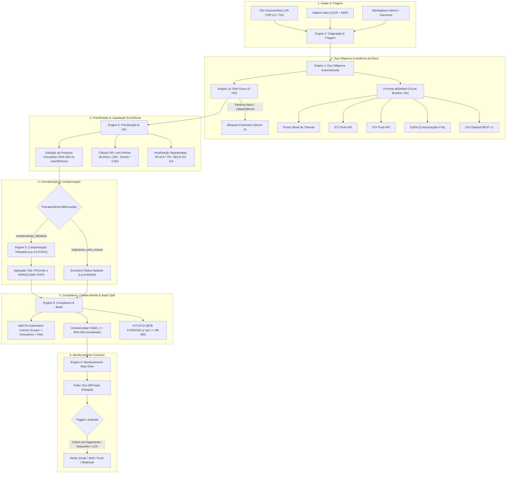

# ARQUITETURA DO MÓDULO ENTERPRISE — VELATRIX AOS
## Precatórios & Liquidez Judicial v3.0

### 1. Visão Geral e Fundamento Normativo
O módulo **Precatórios & Liquidez Judicial v3.0** foi projetado para operar a originação, auditoria preventiva, precificação atuarial, formalização notarial e liquidação de créditos judiciais requisitórios contra a Fazenda Pública Federal, Estadual e Municipal.

O pipeline adere estritamente aos marcos legais vinculantes:
1. **Art. 100 da Constituição Federal de 1988**: Regime constitucional de precatórios, superpreferência de créditos alimentares (§ 1º), compensação tributária (§ 11) e cessão de créditos (§§ 13 e 14).
2. **Emenda Constitucional nº 113/2021 (Art. 3º)**: Aplicação obrigatória da **Taxa SELIC pura** a partir de 09/12/2021 como índice unificado de atualização monetária e remuneração de capital, vedada a cumulação com quaisquer outros índices de correção ou juros moratórios.
3. **Lei nº 14.973/2024 (Art. 5º a 8º)**: Disciplina a compensação de precatórios com dívida ativa da União, com teto de até **75% do débito devido por competência mensal**.
4. **Circular BCB nº 3.978/2020 & Resolução COAF nº 40/2021**: KYC/PLD compulsório para operações com valor superior a R$ 50.000,00, com verificação de listas restritivas e declaração de origem lícita.
5. **Lei nº 8.935/1994 & Resolução CNJ nº 235/2016**: Exigência de Escritura Pública Notarial e encadeamento criptográfico para garantia da cadeia dominial de cessões.

---

### 2. Diagrama de Arquitetura dos 6 Engines & Esteira (Mermaid)

---

### 3. Matriz dos 6 Engines Especializados

| Engine | Arquivo | Responsabilidade | Fontes Oficiais |
|---|---|---|---|
| **Engine 1** | `dueDiligenceEngine.ts` | Auditoria de penhoras, impugnações e litispendência | CNJ Datajud REST, DJEN PJe, STF Push, STJ Push |
| **Engine 1b** | `riskScoreEngine.ts` | Score ponderado 0-100 (Ente 35%, Estabilidade 25%, Histórico 20%, Natureza 10%, Cadeia 10%) | Heurística auditável sem estimativas |
| **Engine 2** | `originacaoEngine.ts` | Query builder composto com filtros por ente, esfera, UF, LOA e score | Fila pública de tribunais, Velatrix Inbox OCR |
| **Engine 3** | `precificacaoEngine.ts` | Atualização monetária segmentada (EC 113) e VPL | SGS 4189 BCB (SELIC), IBGE SIDRA, sha256Store |
| **Engine 4** | `monitoramentoEngine.ts` | Poller real-time com detecção de diff-hash processual | Datajud, Prisma model `PrecatorioMonitor` |
| **Engine 5** | `compensacaoTributariaEngine.ts` | Simulação da Lei 14.973/2024 com teto de 75% por competência | PGFN Regularize, SERPRO API |
| **Engine 6** | `complianceEngine.ts` | KYC/PLD compulsório, Merkle-like Ledger e BaaS Split Pix | Circular BCB 3.978/2020, Celcoin BaaS |

---

### 4. Zero Dados Estimados & Resiliência
- Se um tribunal estiver indisponível ou com circuit breaker aberto, o sistema exibe `— dado não disponível —` com opção de reconsulta e hash de auditoria.
- Timeout de 15s com 3 retries e exponential backoff.
- Cache inteligente TanStack/Memory com TTL de 4 horas para todas as consultas a tribunais.
