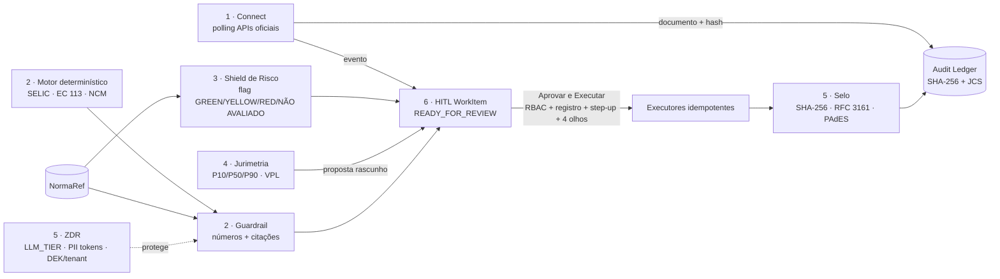

# Velatrix AOS · 6 Ferramentas Enterprise — núcleo de regras

Módulos puros (sem dependências), testáveis com `npm run test:enterprise` (Node 22+).

| Ferramenta | Arquivo | Correção sobre a especificação original |
|---|---|---|
| 1 Connect | `src/enterprise/connect.ts` | Portais gov não têm webhook → polling. PER/DCOMP, DET, DEC: não suportado |
| 2 Guardrail | `deterministicEngine.ts`, `guardrail.ts`, `normaRef.ts` | "Zero erro" → bloqueio de todo número/citação não rastreável |
| 3 Shield | `riskShield.ts` | Catálogo versionado (não "40"); Tema 736 exclui multa isolada 50%; sem dados = NÃO AVALIADO |
| 4 Jurimetria | `jurimetria.ts` | Distribuição, não "data real"; n ≥ 30; sem perfil de juiz/perito |
| 5 ZDR/Selo | `zdr.ts`, `server/enterprise/{envelopeCrypto,laudoSeal,hash}.ts` | "Ponta a ponta" → "em trânsito e em repouso, com chave por cliente"; sem ACT = sem carimbo |
| 6 HITL | `hitl.ts` | Agentes só criam DRAFT/READY; 4 olhos; hash revisado = payload atual |

Pendente (exige `npm install`): rotas Express, modelos Prisma + migration, telas React, troca de `sha256Sync` nos 3 componentes que o usam.
